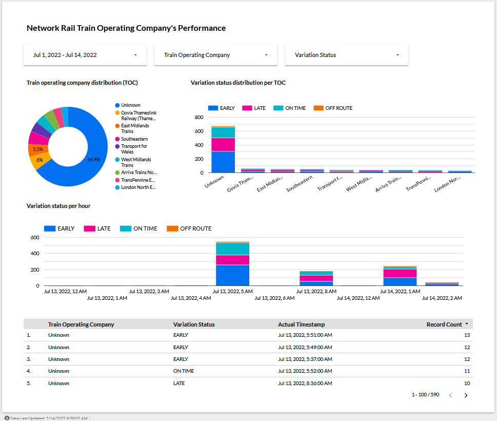

# DataTalks.Club's Data Engineering Zoomcamp Project

**Table of Contents**

* [Project Overview](#project-overview)
* [Dataset](#dataset)
* [Technologies](#technologies)
* [Files and What They Do](#files-and-what-they-do)
* [Instruction on Running the Project](#instruction-on-running-the-project)
* [References](#references)

## Project Overview


This project builds an automated end-to-end data pipeline that aims to get the
livestream of train movement data and analyze the train operating company's
performance.  The source of streaming data comes from the [UK's Network Rail
company](https://datafeeds.networkrail.co.uk) provided through an ActiveMQ
interface. A train movement message is sent whenever a train arrives, passes or
departs a location. It also records the time at which the event happens.

In this project, we first extract the live stream of train movement messages
from the Network Rail's ActiveMQ endpoint and stream the messages into Kafka.
We then consume and put them into a data lake (MinIO). After that we schedule a
data pipeline (Airflow) to run daily to load the data to a data warehouse
(Google BigQuery). Later on, we transform the data in the warehouse using dbt.
Finally, once the data is cleaned and transformed, we can monitor and analyze
the data on a dashboard (Google Data Studio).

## Dataset

In this project, our dataset is the public data feed provided by [Network
Rail](https://datafeeds.networkrail.co.uk).


## Technologies

* [Apache Airflow](https://airflow.apache.org/) for orchestrating workflow
* [Apache Kafka](https://kafka.apache.org/) for stream processing
* [MinIO](https://min.io/) for data lake storage
* [dbt](https://www.getdbt.com/) for data transformation
* [Google BigQuery](https://cloud.google.com/bigquery) for data warehousing and analysis
* [Google Data Studio](https://datastudio.google.com/overview) for dashboard
* [Terraform](https://www.terraform.io/) for provisioning BigQuery dataset
* [Docker](https://www.docker.com/) for running services on local machine

## Files and What They Do

| Name | Description |
| - | - |
| `mnt/dags/load_networkrail_movement_data_to_bigquery.py` | An Airflow DAG file that runs the ETL data pipeline on Network Rail train movement data and load them to BigQuery |
| `networkrail/` | A dbt project used to clean and transform the train movement data |
| `playground/` | A folder that contains code for testing ideas |
| `terraform/` | A Terraform project used to provision the Google BigQuery dataset |
| `.env.example` | A environment example file that contains the environment variables we use in this project |
| `docker-compose.yaml` | A Docker Compose file that runs the Confluent platform (Kafka and friends), an Airflow instance, and MinIO |
| `Makefile` | A Makefile file for running commands |
| `get_networkrail_movements.py` | A Python script that get the live stream data through the Network Rail's ActiveMQ interface |
| `consume_networkrail_movements_to_data_lake.py` | A Python script that consumes the messages from Kafka and puts them into a data lake storage |
| `README.md` | README file that provides the discussion on this project |
| `requirements.txt` | A file that contains Python package dependencies used in this project |
| `secrets.json.example` | A secret file that contains the Network Rail's username and password |

## Instruction on Running the Project

Here is the list of services we use in this project:

* Confluent Control Center: http://localhost:9021
* Airflow UI: http://localhost:8080
* MinIO Console: http://localhost:9001

We can start all services by running the commands below:

```sh
make setup
make up
```

To shutdown all services, run:

```sh
make down
```

### Getting Started

Before we can get the Network Rail data feed, we'll need to register a new
account on [the Network Rail website](https://datafeeds.networkrail.co.uk/)
first.

After we have the account, let's set up a virtual environment and install
package dependencies:

```sh
python -m venv ENV
source ENV/bin/activate
pip install -r requirements.txt
```

**Note:** We need to install the Apache Kafka C/C++ Library named
[librdkafka](https://github.com/edenhill/librdkafka) first.

Once we've installed the package dependencies, we can run the following command
to get the Network Rail livestream data and produce messages to the Kafka:

```sh
python get_networkrail_movements.py
```

Before we can consume the messages from Kafka, we need to set up a service
account on MinIO first, so we can put the data into a data lake. Please see the
[Steps to Set Up a Service Account on
MinIO](#steps-to-set-up-a-service-account-on-minio) section.

After we have the service account, we'll save the AWS access key ID and AWS
secret access key from MinIO to the file `.env`. Here we have an example env
file, so we can use it as a template.

```sh
cp env.example .env
```

To consume the messages from Kafka, run the following commands:

```sh
export $(cat .env)
python consume_networkrail_movements_to_data_lake.py
```

All the messages should be in the data lake (MinIO) by now.

We can go to the Airflow UI and manually trigger the data pipeline to load the
data to the data warehouse (Google BigQuery) then wait for the data to show up
on the dashboard (Google Data Studio). See the live dashboard
[here](https://datastudio.google.com/reporting/5d38cb3d-248e-4aed-b65f-0db54fab4b9d).

## References

### Kafka Topic on Confluent Control Center

The screenshot below shows the Kafka topic on Confluent control center.


### Data Pipeline on Airflow

The screenshots below show the data pipeline on Airflow.


### Airflow S3 Connection to MinIO

- Connection Name: `minio` or any name you like
- Connection Type: S3
- Login: `<replace_here_with_your_minio_access_key>`
- Password: `<replace_here_with_your_minio_secret_key>`
- Extra: a JSON object with the following properties:
  ```json
  {
    "host": "http://minio:9000"
  }
  ```

**Note:** If we were using AWS S3, we don't need to specify the host in the extra.

### Data Models on Google BigQuery

The screenshot below shows the data models on Google BigQuery.


### Network Rail TOC's Performance Dashboard

The screenshot below shows the dashboard to monitor the Network Rail train
operating company (TOC)'s performance. View the live dashboard here: [Network
Rail Train Operating Company's
Performance](https://datastudio.google.com/reporting/5d38cb3d-248e-4aed-b65f-0db54fab4b9d).




### Steps to Set Up a Service Account on MinIO

The screenshots below show how to set up a service account on MinIO. Airflow
needs it in order to get data from the MinIO storage.


### Steps to Set Up a Service Account on Google Cloud Platform (GCP)

The screenshots belwo show how to set up a service account on GCP. This service
account is required for Airflow to load data to the BigQuery as well as dbt to
transform data in the BigQuery.


